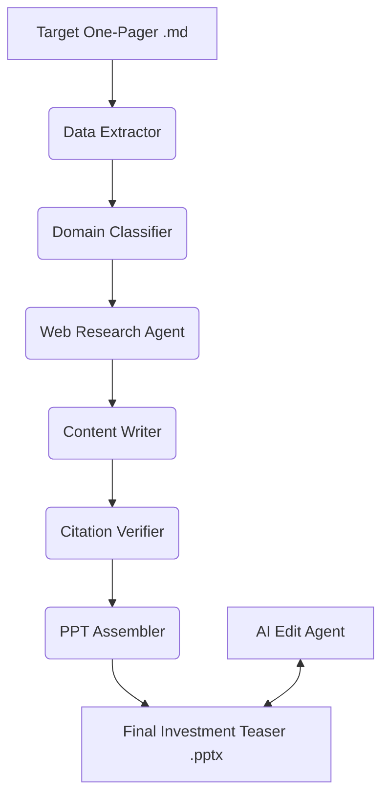

# 🌊 KELP M&A Automation

An advanced AI-powered pipeline to automate the creation of **Information Teasers** (Investment PPT Decks) for M&A deals. It extracts data from one-pagers, enriches it with real-time web research, verifies every claim with citations, and generates a professional, high-fidelity 3-5 slide PowerPoint deck.

---

## 🚀 Key Features

- **Multi-Agent Orchestration**: Specialized agents for data extraction, domain classification, web research, content writing, and PPT assembly.
- **Real-Time Market Enrichment**: Scrapes industry news, market size (TAM), and news tailwinds using Google Search and Requests.
- **100% Citation Verification**: Every number and fact in the PPT is cross-referenced with a source (One-Pager or Web).
- **Interactive AI Editor**: A built-in chat assistant in the GUI to refine slide content, tone, or metrics on the fly.
- **High-Fidelity PPT Assembly**: Uses "In-Place Rebuild" logic to preserve professional slide templates while injecting dynamic content.
- **Self-Healing Layout**: Robust logic to prevent text overflow, handle missing data via fallbacks, and auto-randomize image selection.

---

## 🛠️ Project Architecture



### Agents Deep-Dive
1. **Data Extractor**: Parses Markdown one-pagers into structured JSON with financial validation.
2. **Domain Classifier**: Identifies the company sector (Manufacturing, Tech, etc.) to tailor the research and layout.
3. **Web Scraper**: Discovers company websites and identifies market reports, news, and industry CAGR.
4. **Content Writer**: Synthesizes inputs into high-impact investment hooks and slide bullet points (Refined by LLM).
5. **Citation Verifier**: Ensures factual integrity by auditing every generated statement against raw sources.
6. **PPT Assembler**: Manages the native PowerPoint engine, dual-axis charts, and editable pie charts.
7. **AI Edit Agent**: (NEW) A real-time chat agent that allows users to modify the generated slide content using natural language.

---

## 🖥️ Graphical User Interface (GUI)

The project includes a professional Streamlit-based GUI.

### Run GUI
```bash
python -m streamlit run gui/app.py
```

### GUI Capabilities:
- **LLM Selection**: Toggle between **Gemini (Flash 2.0)** and **Local Ollama (Qwen 2.5/Llama 3.2)**.
- **Result Explorer**: Live tabs to preview citations, scraped web data, and token usage logs.
- **Interactive Chat**: Prompt the AI to "Make Slide 3 more succinct" or "Add a bullet about ESG goals" and see the PPT update instantly.

---

## 📝 Input Format

One-pager must be Markdown with sections:

```markdown
# Company Name

## Business Description
[Description here]

## Products & Services
- Product 1
- Product 2

## Financials
### Revenue (₹ Cr)
- FY23: 150
- FY24: 180

## Key Shareholders
- Promoters: 65%
- FII: 20%
```

Refer to `data/input/` for comprehensive examples.

---

## ⚠️ Robustness & Fallbacks

- **Missing Financials**: If CAGR or EBITDA is missing, the agent falls back to RoCE, Gross Margins, or qualitative growth insights.
- **Thin Web Data**: If scraping fails or market data is sparse, the system injects professional sector-wide context (e.g., "Make in India" tailwinds).
- **Corruption Prevention**: Implements a "clean-rebuild" strategy for PowerPoint XML to ensure zero file corruption issues.
- **Anonymization Engine**: Multi-pass filtering (Regex, NER, and LLM) ensures target names are always replaced with "The Company".

---
*Created by the Kelp M&A Team – 2026*
