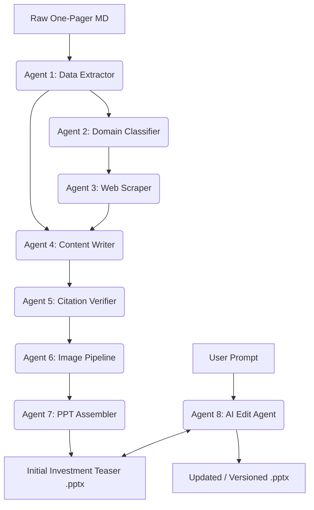

# 🌊 KELP M&A Automation Pipeline
*An enterprise-grade, agent-orchestrated platform for generating professional Investment Teaser Presentations.*

The **KELP M&A Automation Pipeline** is an advanced, AI-powered system designed to automate the initial stages of Merger and Acquisition (M&A) deal preparation. By taking a simple company one-pager in Markdown format, the system deploys a sequence of specialized AI agents to extract data, conduct live web research, guarantee factual accuracy via citations, and finally assemble a highly polished, fully editable PowerPoint Presentation.

---

## 📋 Table of Contents
1. [System Anatomy & Orchestration](#-system-anatomy--orchestration)
2. [Deep-Dive: Agent Anatomy](#-deep-dive-agent-anatomy)
     - [Agent 1: Data Extractor (Deterministic Parsing)](#agent-1-data-extractor-deterministic-parsing)
     - [Agent 3: Web Scraper (Smart Page Discovery)](#agent-3-web-scraper-smart-page-discovery)
     - [Agent 4: Content Writer (The Synthesis Engine)](#agent-4-content-writer-the-synthesis-engine)
     - [Agent 7: PPT Assembler (High-Fidelity Rebuild)](#agent-7-ppt-assembler-high-fidelity-rebuild)
3. [Step-by-Step Execution Flow](#-step-by-step-execution-flow)
4. [Core Capabilities & Data Handling](#-core-capabilities--data-handling)
     - [Domain Identification & Industry Templates](#domain-identification--industry-templates)
     - [Anonymity Engine](#anonymity-engine)
     - [Chart Editability & Native Objects](#chart-editability--native-objects)
5. [Missing Data & Error Handling](#-missing-data--error-handling)
6. [Citation & Verification Logic](#-citation--verification-logic)
7. [Interactive Chat-Based PPT Editor](#-interactive-chat-based-ppt-editor)
8. [GUI Features (Streamlit)](#-gui-features-streamlit)

---

## 🤖 System Anatomy & Orchestration

The pipeline is organized into a highly modular, multi-agent architecture. The workload is distributed among 8 specialized agents, each handling a distinct phase of the presentation creation process.

---

## 🔬 Deep-Dive: Agent Anatomy

### Agent 1: Data Extractor (Deterministic Parsing)
Unlike traditional RAG systems that "chat" with documents, Agent 1 uses a **Deterministic Parsing Engine**. 
- **Mechanism**: It utilizes complex Regular Expressions (Regex) and `pandas` table parsing to extract structured data from Markdown.
- **Financial Intelligence**: It searches for varying table headers (e.g., "Revenue", "Turnover", "Sales") and normalizes them into a consistent `FinancialData` dataclass.
- **Robustness**: It automatically calculates YoY growth rates and EBITDA margins if only raw numbers are provided, ensuring the downstream agents always have a complete financial profile.

### Agent 3: Web Scraper (Smart Page Discovery)
The scraper is designed for **Deep Context Mining** rather than simple keyword searches.
- **Smart Discovery**: It attempts to find the target's "About Us," "Products," and "News" pages by analyzing the sitemap and internal links using Playwright.
- **Tiered Fallback**:
    1. **Playwright (Priority)**: Full JS rendering to bypass modern dynamic sites.
    2. **Requests (Fallback)**: Lightweight HTML fetching if Playwright is blocked.
    3. **Macro-IQ Heuristics**: If the target site is unreachable, it pulls from `MARKET_DATA_SOURCES`—a curated internal database of industry-specific CAGR, TAM, and news tailwinds (e.g., PLI scheme effects for Manufacturing).

### Agent 4: Content Writer (The Synthesis Engine)
This is the LLM-powered "Bridge" that turns raw data into a professional narrative.
- **Data Fusion**: It merges the "Hard Facts" from the one-pager with "Live Intelligence" from the web.
- **Protection Logic**: Implements a `NEVER_SHORTEN` rule. Critical assets like product lists or shareholder names are protected from summarization to maintain professional fidelity.
- **Contextual Awareness**: It writes domain-specific "Hooks." For a technology firm, it emphasizes ROI and scalability; for a manufacturing firm, it focuses on asset heavy-lifting and capacity utilization.

### Agent 7: PPT Assembler (High-Fidelity Rebuild)
The assembler uses a **"Template Overlay"** strategy to ensure perfect design standards.
- **Template Utilization**: It leverages the industry-specific templates found in `kelp_ma_automation/templates/`. These are pre-branded `.pptx` files with professional Slide Masters for each of the 8 domains.
- **In-Place Rebuild**: Instead of building a file from scratch (which often leads to XML corruption), it opens a master template (`Sample Output.pptx`) and programmatically clones and modifies slides.
- **Native Charting**: It builds **Editable Native PPT Charts**. Every bar and pie chart is a functional PowerPoint object that you can right-click and "Edit Data in Excel" post-generation.

---

## 🏗️ Core Capabilities & Data Handling

### Domain Identification & Industry Templates
Agent 2 classifies the company into one of 8 domains. This selection is critical because it determines which **Industry Template** is used from the `templates/` folder:
- **Available Templates**: `technology`, `manufacturing`, `healthcare`, `logistics`, `infrastructure`, `chemicals`, `automotive`, `consumer`.
- **Why it matters**: A Technology deck shouldn't look like a Logistics deck. Each template comes with pre-set fonts, icon styles, and layout grids optimized for that sector.

### Anonymity Engine
M&A operations require extreme confidentiality. The system features a multi-pass Anonymization Engine:
1. **Regex Scanning**: Replaces exact matches of the input company name.
2. **NER (Named Entity Recognition)**: Checks for alternate spellings and abbreviations of the company name.
3. **LLM Sanitization**: During the Content Writer phase, a strict instruction forces the model to refer to the entity strictly as **"The Company"** or **"The Target"**.

### Chart Editability & Native Objects
A massive technical hurdle in automated PPT generation is chart creation. Rather than pasting dead PNG images, **Agent 7** constructs **Native PowerPoint Charts**.
- **Bar/Column Charts**: Dual-axis financial trends (e.g., Revenue vs. EBITDA Margins) are plotted using underlying Excel XML objects.
- **Stakeholder Pie Charts**: Capital structures are mapped into a Donut/Pie chart.
- Because these are native, investment bankers can open the final `.pptx` file and tweak the numbers in Excel just as if they had built it manually.

---

## 🛡️ Missing Data & Error Handling
- **Financial Fallbacks**: If the input one-pager is missing EBITDA, Agent 7 automatically searches for Gross Margins or PAT.
- **Smart Merge (Edit Agent)**: If a lightweight LLM (like `qwen2.5:3b`) accidentally deletes a chart's metadata during a chat-edit, the Python core intercepts and **merges** the original chart data back in automatically to prevent "broken" slides.

---

## 🔎 Citation & Verification Logic
Trust is paramount. **Agent 5** implements a 100% mapping policy:
1. **Claim Extraction**: The LLM parses the generated PPT to extract definitive statements.
2. **Source Cross-Referencing**: It identifies the origin URL or Memo line for every bullet point.
3. **Report Generation**: A downloadable `.docx` is generated presentation-wide, providing a tabular audit trail for every single claim.

---

## 💬 Interactive Chat-Based PPT Editor
The **Edit Agent (Agent 8)** allows you to refine the deck using natural language:
- **Pre-Serialization Defense**: Prevents browser crashes by cleaning complex Python objects into simple strings before sending them to the LLM.
- **Instant Re-Render**: Generates a new file version (e.g., `_v1.pptx`, `_v2.pptx`) so your history is always safe.

*Designed for extreme reliability, elite document synthesis, and seamless human-in-the-loop interactivity. -- Kelp M&A Automation Team 2026*
